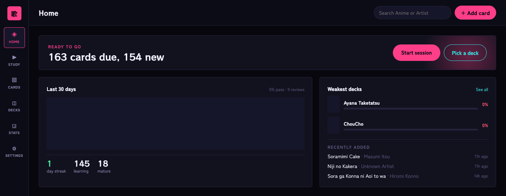
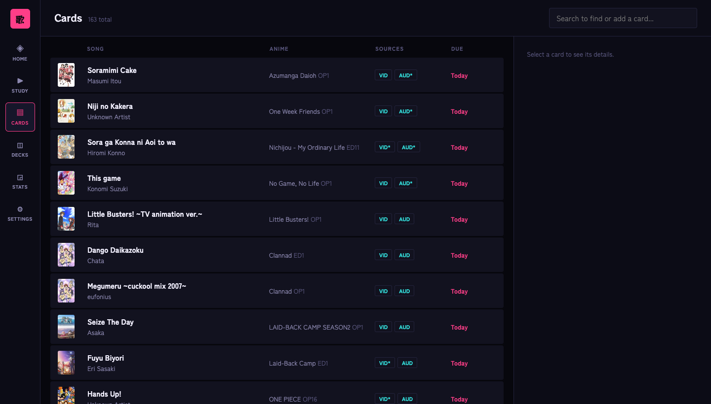
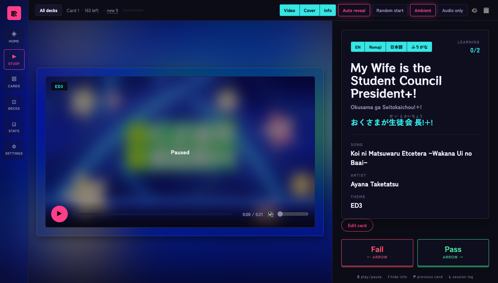
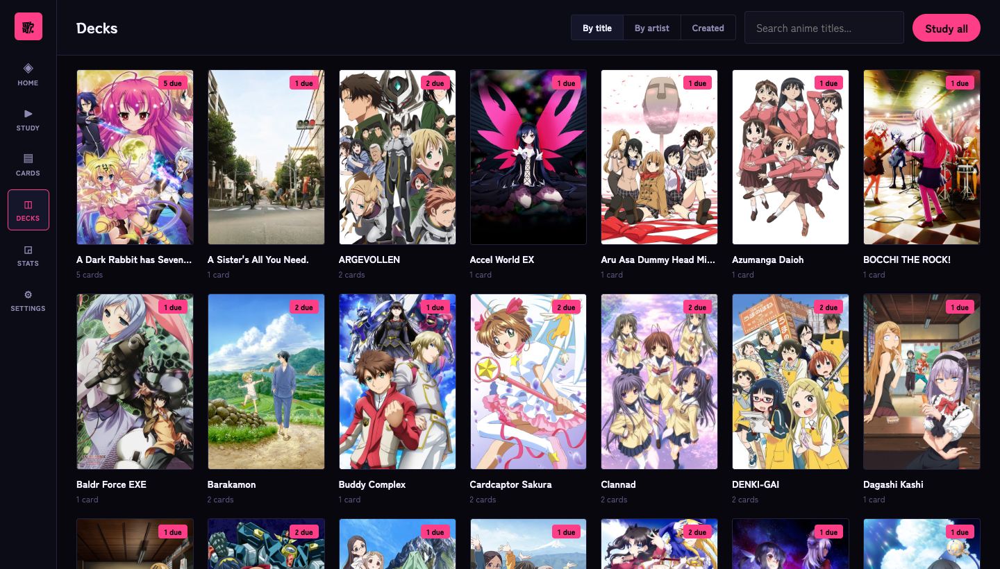

# GAQ SRS

Flashcards for anime songs. You hear an opening or ending, try to name the
anime, the song, and the artist, and the app schedules it to come back later -
more often for the ones you keep missing, rarely for the ones you know cold.

Built for practicing [animemusicquiz.com](https://animemusicquiz.com) (AMQ).
Song data and clips come from AniList and animethemes.moe. Everything else -
your library, your review history - stays on your own machine. There is no
account, no sync, and no server but the one running on your laptop.

<p align="center">
  
</p>

## Install

Grab your platform from the
[Releases](https://github.com/wiredPuru/Anisong-SRS/releases) page, unzip it,
and run the executable. It starts a local server and opens your browser. No
Node, Bun, or Nuxt install needed.

| Platform | File |
| --- | --- |
| Windows (x64) | `gaq-srs-windows-x64.zip` |
| macOS (Apple Silicon) | `gaq-srs-macos-arm64.zip` |
| macOS (Intel) | `gaq-srs-macos-x64.zip` |
| Linux (x64) | `gaq-srs-linux-x64.zip` |

Keep the executable next to the `migrations/`, `public/`, and `kuromoji/`
folders it ships with - it reads all three from disk at startup.

The builds are not code-signed, so you get a warning the first time:

- **macOS** - right-click the executable and choose Open, then confirm. On
  v1.1.0 and earlier you may instead see `"gaq-srs" is damaged and can't be
  opened`, which is misleading; the file is fine. Either download v1.2.0 or
  later, or clear the quarantine flag:
  `xattr -dr com.apple.quarantine /path/to/folder`
- **Windows** - SmartScreen shows "Windows protected your PC". Choose More
  info, then Run anyway.
- **macOS/Linux** - if the file will not execute, `chmod +x gaq-srs`.

Your database lives outside the app folder (in your OS's standard app-data
directory), so upgrading is just replacing the folder.

## Getting started

### 1. Add some cards

Go to **Cards** and type into the search box. It searches the cards you already
have and, at the same time, offers new ones to add from three directions:

- **by anime** - pick a show, then pick which openings and endings you want
- **by song** - if you know the track name but not the show
- **by artist** - pulls that artist's whole catalog across every anime they
  have themes in, so you can add them in bulk

Each result has an Add button. Added cards show up in the list immediately.

<p align="center">
  
</p>

By default, clips stream from animethemes.moe and get cached to disk as you
play them. If you would rather keep local copies, set a download folder in
**Settings -> Media library**, then use the download action on a card. Already
have a folder of clips? Add it under Local folders and point cards at those
files instead.

### 2. Study

Hit **Study**. You get a clip and a hidden answer; play it, guess, then reveal
and mark yourself.

<p align="center">
  
</p>

The panel on the right shows the anime title in English, Romaji, and Japanese,
each independently toggleable, with furigana over the kanji if you want it. In
the shot above the video itself is veiled - that is the Hide Video toggle, so
you are guessing from audio alone.

Answer with **Pass** or **Fail** (or the left and right arrow keys). Pass moves
a card up a box and pushes it further out; fail sends it back to box 1 and it
returns in the same session.

| Box | Comes back in |
| --- | --- |
| 1 | immediately |
| 2 | 1 day |
| 3 | 3 days |
| 4 | 7 days |
| 5 | 14 days |

The row of toggles up top changes how much you get to see: hide the video, hide
the cover art, hide the info panel, start at a random point in the clip, or let
**Auto reveal** uncover the answer on a timer. There is also an ambient glow
mode that samples colour from whatever is playing.

**Hotkeys**

| Key | Does |
| --- | --- |
| <kbd>&larr;</kbd> / <kbd>&rarr;</kbd> | Fail / Pass |
| <kbd>S</kbd> | Play / pause |
| <kbd>I</kbd> | Hide or show the info panel |
| <kbd>V</kbd> | Hide or show the video |
| <kbd>C</kbd> | Hide or show the cover art |
| <kbd>A</kbd> | Ambient glow |
| <kbd>H</kbd> | Hide or show the toggle row |
| <kbd>P</kbd> | Reopen the card you just reviewed |
| <kbd>L</kbd> | Session log |

### 3. Study a slice of your library

**Decks** groups your cards automatically by anime and by artist, so you can
drill one show or one singer instead of everything. You can also create your
own decks and put whatever you like in them.

<p align="center">
  
</p>

Any deck can be studied on its own, and artist and anime decks can be exported
to a folder and imported back (or handed to someone else).

### 4. Check how you are doing

**Stats** tracks your guess rate over time, broken down by artist and by anime,
so you can see which shows you keep whiffing.

**Settings** is where you point the app at local clip folders, set a download
folder, cap the size of the streaming cache, choose audio-only playback, and
pace how many new cards get introduced per day.

## Building from source

The app lives in `nuxt-app/`:

```bash
cd nuxt-app
bun install
bun run dev        # http://localhost:3000
```

Build, packaging, and other commands are in [AGENTS.md](AGENTS.md), along with
the workflow this project is built with.

Nuxt + TypeScript, SQLite via Drizzle, Bun for the runtime and the standalone
executables.
