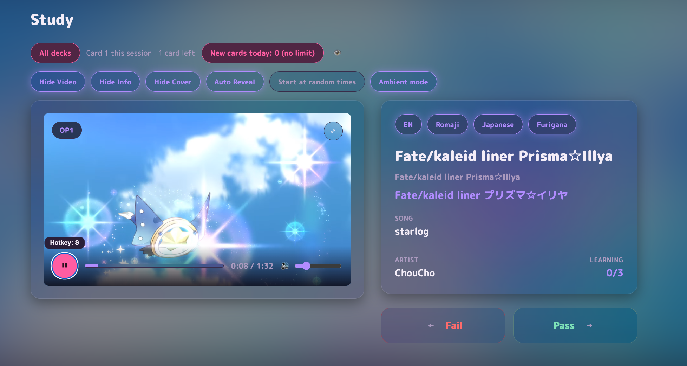
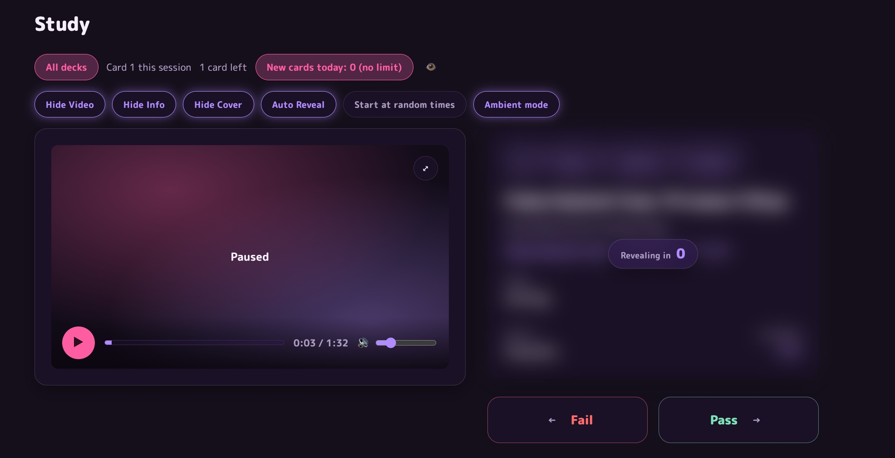
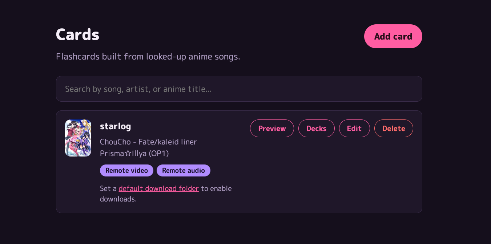
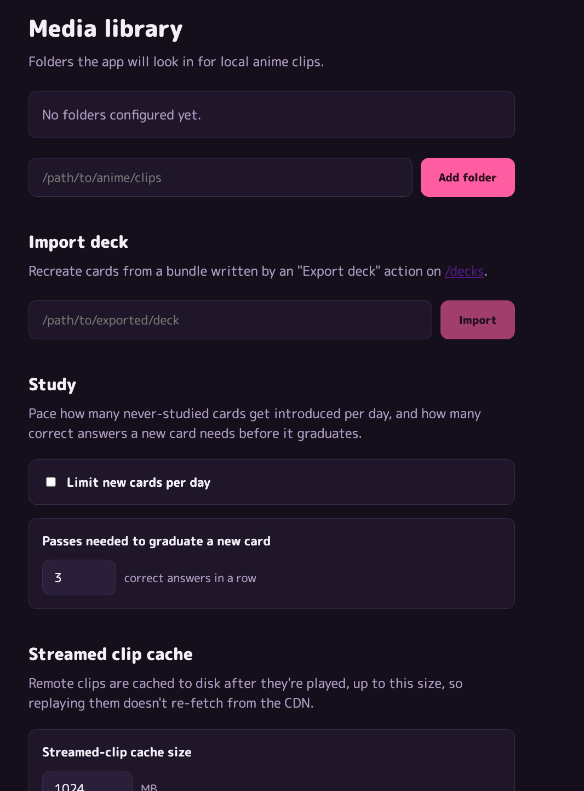

# GAQ SRS

A personal, local-only spaced-repetition flashcard app for memorizing anime
opening/ending songs, titles, and artists - built for practicing
[animemusicquiz.com](https://animemusicquiz.com) (AMQ). Card metadata and
clips are pulled from AniList and animethemes.moe; everything else (your
library, your review history) stays on your own machine.

## Screenshots

<p align="center">
  <br>
  <sub>Study session - video playback, pass/fail, and language toggles (EN / Romaji / Japanese + Furigana)</sub>
</p>
<p align="center">
  <br>
  <sub>Ambient mode, with Hide Info and Auto Reveal active</sub>
</p>
<p align="center">
  <br>
  <sub>Card library with search</sub>
</p>
<p align="center">
  <br>
  <sub>Media library, deck import, and study-pacing settings</sub>
</p>

## Features

- **Add cards** by anime, by artist, or by song title, via AniList and
  animethemes.moe lookup - including bulk artist import (pull an artist's
  entire catalog at once)
- **Study sessions** using a 5-box Leitner scheduler, with video/audio
  playback, pass/fail review, an immersive full-screen mode, and independent
  English / Romaji / Japanese+Furigana title toggles
- **Decks** - automatic Artist and Anime-Title groupings, plus manual decks
  you create and organize yourself
- **Stats** - guess-rate tracking, overall and sliced by artist or anime
- **Media handling** - local file support, remote streaming with an on-disk
  cache, download-to-local, and deck export/import
- **Global search** across your cards, artists, and anime
- **Standalone packaging** - runs as a double-clickable executable with no
  Node/Bun/Nuxt install required (see Downloads below)

## Downloads

Prebuilt executables for Windows, macOS (Intel and Apple Silicon), and Linux
are published on the [Releases](https://github.com/wiredPuru/Anisong-SRS/releases)
page. Download the archive for your platform, unzip it, and run the
executable - it starts a local server and opens your browser to it
automatically.

## Tech stack

- [Nuxt](https://nuxt.com) (TypeScript) - application framework
- SQLite + [Drizzle ORM](https://orm.drizzle.team) - local data storage
- [AniList](https://anilist.co) and [animethemes.moe](https://animethemes.moe) - anime/song metadata and clips
- [Bun](https://bun.sh) - runtime, package manager, and standalone executable packaging

## Development

The app lives in `nuxt-app/`:

```bash
cd nuxt-app
bun install
bun run dev        # http://localhost:3000
```

Other commands (build, test, package a release binary) are documented in
[AGENTS.md](AGENTS.md).

This project is scaffolded with the AI Blueprint workflow layer - see
`AGENTS.md` and `blueprint/` for how it's built.
