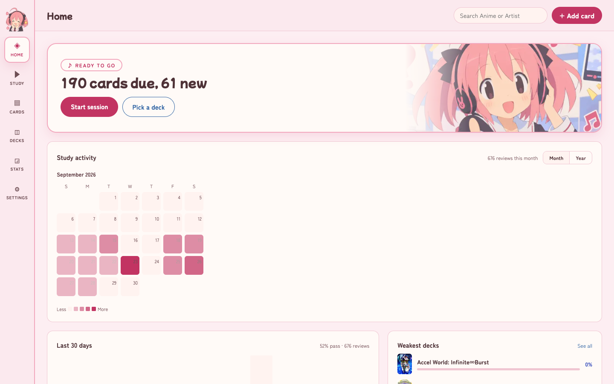
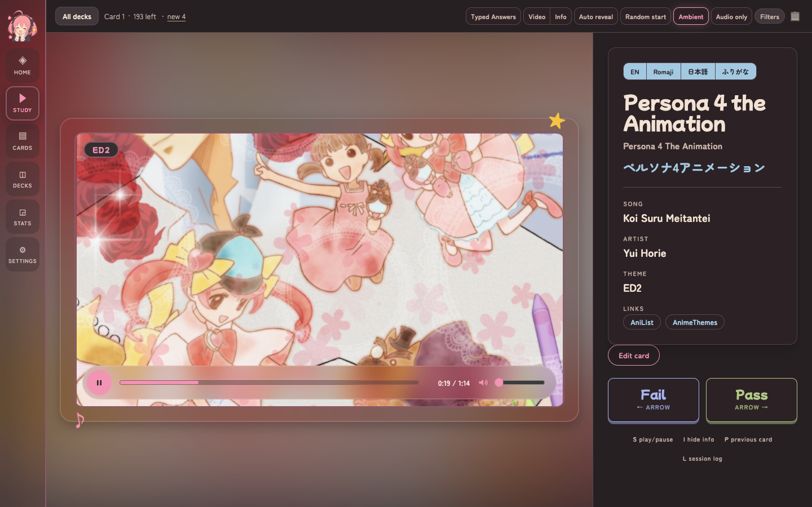
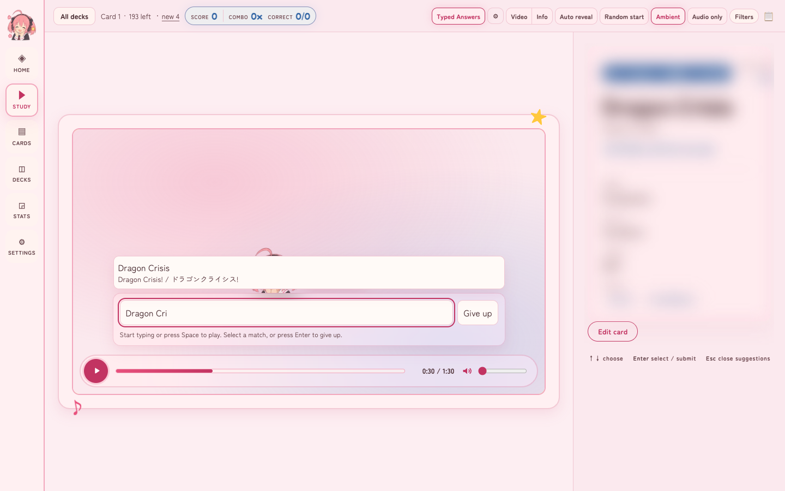
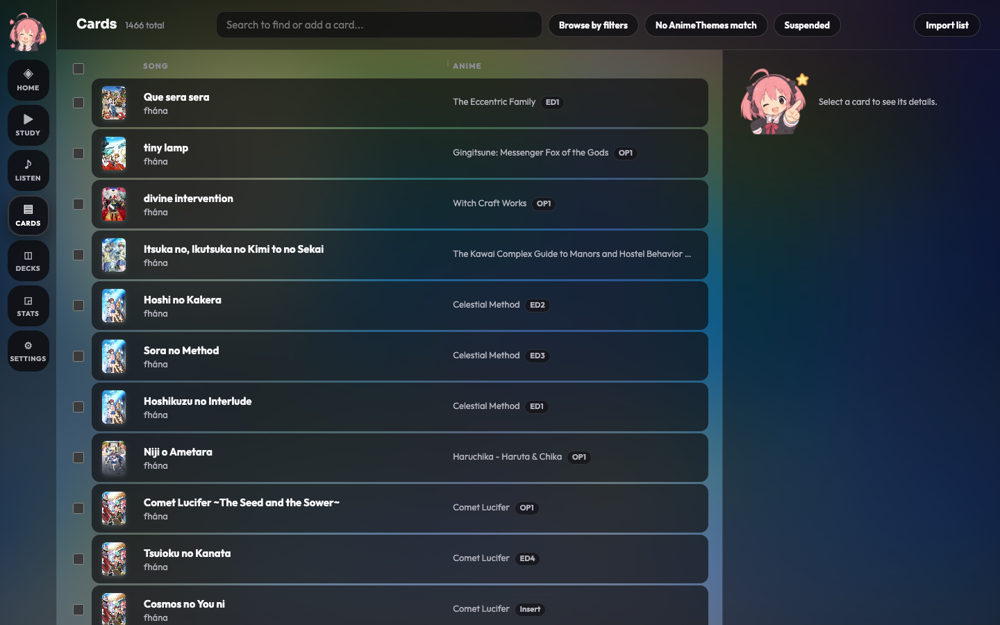
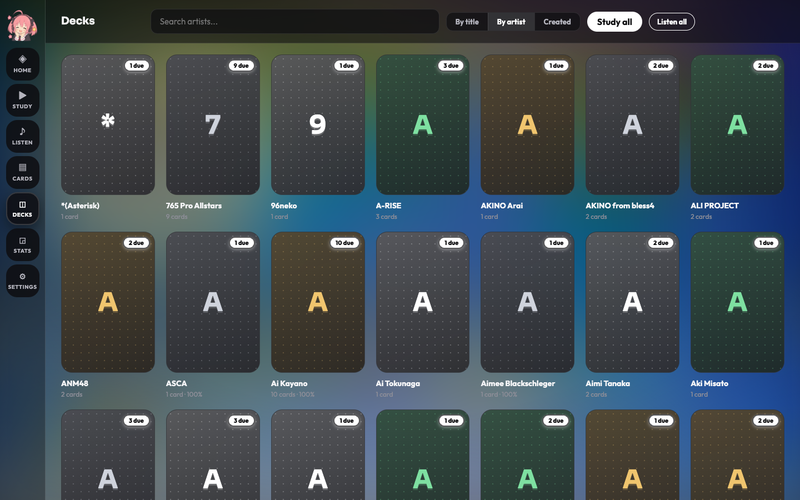
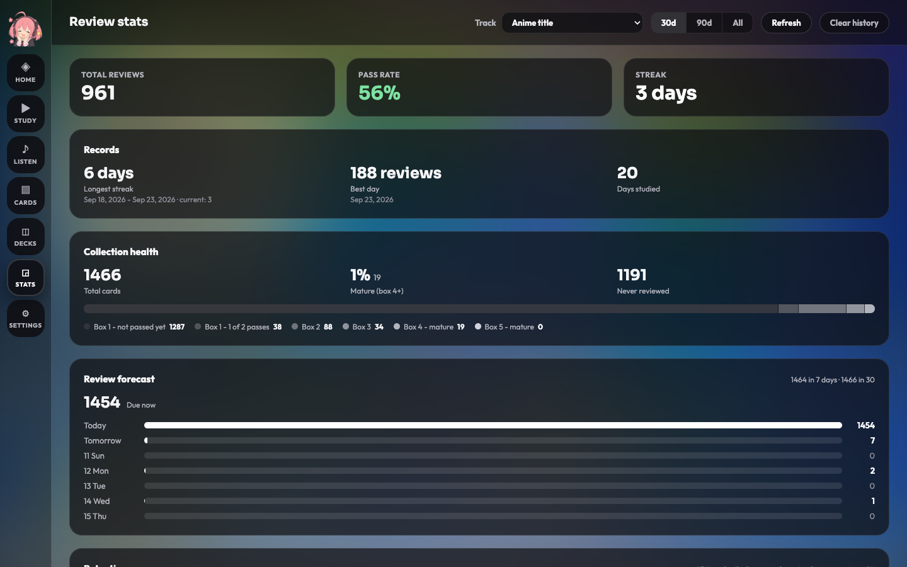
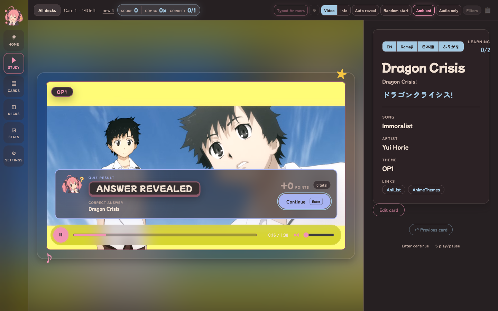

  

# GAQ SRS

**Get better at Anime Music Quiz, one song at a time.**

If you've played [Anime Music Quiz](https://animemusicquiz.com), you know the
feeling: a song starts, it sounds *so* familiar, and the timer runs out before
the name comes back to you. GAQ SRS is built for exactly that problem.

It's a flashcard app for anime openings, endings, and insert songs. You hear a
clip, try to name the show (and, if you like, the song and the artist), and the
app keeps track of what you know. Songs you miss come back soon. Songs you nail
get pushed further out. Over time, the ones that used to stump you start
landing in the first few seconds.

Everything runs on your own computer. Your library, your progress, and your
review history stay with you, with no account and no cloud.

  

## Studying

The Study screen is where most of your time goes. A clip plays, you take your
guess, and then you reveal the answer and mark whether you got it. The side
panel shows the anime in English, romaji, and Japanese (with optional furigana),
along with the song, artist, which opening or ending it is, and links out to
AniList and AnimeThemes.

  

You decide how many hints you get. Hide the video so it's audio only, blur the
answer panel, start each clip at a random point instead of the intro, or let
**Auto Reveal** uncover things on a timer. The ambient glow picks up the colors
of whatever's playing and washes them across the screen, and audio-only songs
spin the show's cover art on a little record.

### Typed answers

Turn on **Typed Answers** and it plays more like the real game: you type the
anime title, pick from suggestions, and the app grades you. Keep a combo going
to rack up points. You can also add bonus rounds for the song name and the
OP/ED number.

  

## Building your library

The **Cards** page is both your collection and where you find new songs. Type
an anime, a song, or an artist and you'll see what you already have alongside
everything you could add. Pull in a whole show's themes at once, grab an
artist's entire catalog, or import your completed list from AniList or
MyAnimeList and pick from there.

  

Clips stream from AnisongDB, with AnimeThemes as a backup, and are cached as
you listen. You can also download them or point the app at music files you
already have. If something stops playing, **Library health** in Settings finds
the broken cards and helps you fix them.

## Decks

Your cards group themselves into decks by anime and by artist automatically,
so studying "everything by FLOW" or "just Monogatari" takes one click. You can
also make your own decks and fill them however you like: by hand, by copying
other decks, or with filters like year, season, genre, tags, score, or
"shows on my AniList."

  

A deck you make can also change *what* you're tested on. Set it to the song
name, the artist, the OP/ED number, or any mix of those, and it keeps its own
schedule. So drilling artists never throws off how well you know the shows.

## Seeing your progress

**Stats** shows how you're actually doing: your pass rate, your streaks and
best days, how many cards are still learning versus locked in, what's coming
due over the next week, and which songs keep tripping you up.

  

## Light or dark

GAQ SRS follows your system's light or dark setting by default, and you can
pick one yourself in Settings. Kai, the mascot, hangs around in both. She
cheers when you get one right and slumps a little when you don't.

  

## Party mode

GAQ SRS also comes with **Guess the Anime**, a party game for game nights and
streams. Put the display on a TV, projector, or OBS, and run the show from your
phone. Queue up songs from your own decks and filters, add effects like blur,
pixelation, or a blacked-out screen, run fast-paced lightning rounds, keep
score, and play lobby music between rounds. The screen never shows an answer
until you reveal it, and nothing you play there touches your study progress.

## How the spacing works

Every card sits in one of five boxes. Get it right and it moves up a box; miss
it and it drops back to the first one, where it can come around again the same
session.

| Box | Comes back in |
| --- | --- |
| 1 | Right away |
| 2 | 1 day |
| 3 | 3 days |
| 4 | 7 days |
| 5 | 14 days |

It's simple on purpose. The songs you struggle with get lots of attention, and
the ones you know stay out of the way.

---

Grab the latest version from the
[Releases page](https://github.com/wiredPuru/Anisong-SRS/releases). Anime
details come from AniList, and song data and clips come from AnisongDB and
AnimeThemes.
