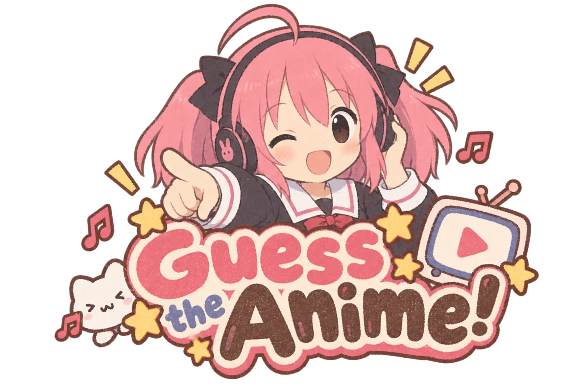

  

# GAQ SRS

**Get better at Anime Music Quiz, one song at a time.**

If you've played [Anime Music Quiz](https://animemusicquiz.com), you know the
feeling: a song starts, it sounds *so* familiar, and the timer runs out before
the name comes back to you. GAQ SRS is built for exactly that.

It's a flashcard app for anime songs. You hear a clip, try to name the show,
and the app remembers how it went. Songs you miss come back soon, and songs you
know get pushed further out. Over time, the ones that used to stump you start
landing in the first few seconds.

Everything runs on your own computer. No account, no cloud, just you and your
playlist.

  

## How it works

### 1. Add the songs you want to learn

Search for an anime, a song, or an artist, and add the openings and endings you
want to practice. You can grab one song, a whole show, or everything an artist
has sung.

  

### 2. Listen and guess

Hit **Start session** and the clips start playing. Take your guess, reveal the
answer, and mark whether you got it. That's the whole loop. Hide the video if
you want to go by ear alone, or type your answers if you want it to feel like
the real game.

  

### 3. Focus on what you want

Your songs sort themselves into decks by anime and by artist, and you can make
your own too. Want to drill one show before a themed lobby? Just study that
deck.

  

### 4. Watch yourself improve

Keep an eye on your pass rate, your streak, and what's coming up next, so you
can see it actually sticking.

  

## Party mode

GAQ SRS also comes with **Guess the Anime**, a party game for game nights and
streams. Put the display on a TV or stream it, run the show from your phone,
and see who in the room really knows their openings.

---

Grab the latest version from the
[Releases page](https://github.com/wiredPuru/Anisong-SRS/releases). Anime
details come from AniList, and song data and clips come from AnisongDB and
AnimeThemes.
